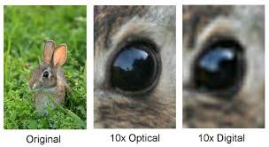
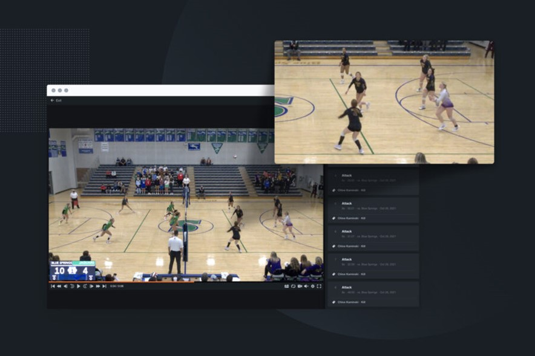
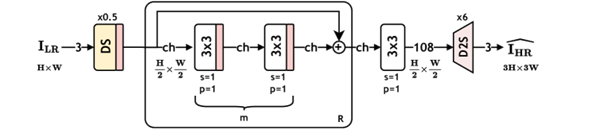
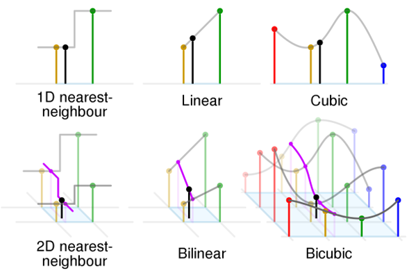
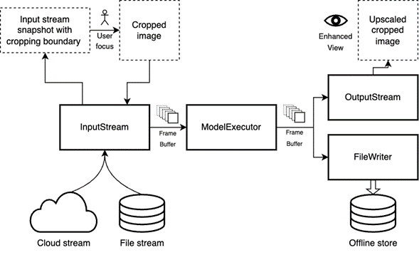
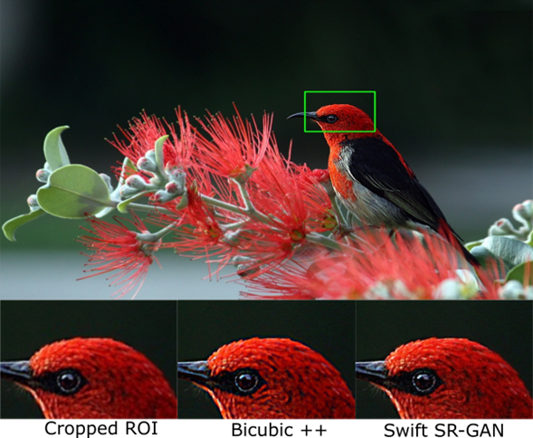
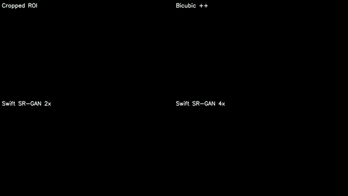

## Welcome to Dynamic Zoom

Dynamic Zoom is a project developed at the University of Wisconsin-Madison ECE 766 Class, designed to enhance video resolution in real time, transforming how digital media is consumed and produced across various industries. Leveraging cutting-edge super-resolution technologies, this project addresses the common degradation of video quality during digital zoom, such as blurring and pixelation, which affects viewer satisfaction and hampers professional digital analysis. By integrating advanced machine learning algorithms and computational strategies, Dynamic Zoom aims to deliver high-definition content without the substantial processing time associated with traditional super-resolution methods. 

  

**Team:** Shantanu Vichare, Dario Placencio, Nico Ranabhat, Hemanth Sridhar Nakshatri  
**Course:** CS 766 - Computer Vision  
**Institution:** University of Wisconsin-Madison

## Motivation

The need for high-definition, clear imagery is more critical than ever across various fields:

- **Sports Analysis:** Enhancing video quality for clearer slow-motion replays.
- **Augmented Reality:** Improving the resolution for more immersive experiences.
- **Security and Surveillance:** Increasing video clarity for better monitoring and analysis.
- **Search and Rescue Operations:** Enhancing video details to aid critical missions.

## Challenges and Innovation

Digital zoom often results in significant quality degradation, such as pixelation, like the following example: 

  

Our project, Dynamic Zoom, aims to address these issues by providing a real-time solution that not only enhances clarity but also operates efficiently. This is based on the application of advanced super-resolution techniques limited to the key Regions of Interest (ROIs) in the video frames.

  

## Technical Insight

Our approach utilizes the Bicubic++ model, highly awarded for its efficiency and effectiveness in enhancing low-resolution images in real time. This model selection is based on its ability to generate high-quality images with minimal computational resources, when comparing to other advanced super-resolution methods like SwiftsSRGAN, that while powerful, do not offer the speed necessary for real-time applications.

### Bicubic++ Model

  

Bicubic++ is an advanced super-resolution model using deep learning and convolutional neural networks (CNNs) to enhance video and image quality. Trained on a broad dataset of image pairs, it efficiently learns to upscale images while preserving detail and texture. Key features include PixelShuffle for effective resolution enhancement and smoother pixel calculation functions to optimize image sharpness. Utilized by Dynamic Zoom, Bicubic++ ensures high-quality video output in real time, ideal for performance-critical applications.

  

## Methodology

Dynamic Zoom combines GPU-accelerated processing with advanced machine learning techniques:

### PyTorch and CUDA Integration

- **High-Performance Computing:** By integrating PyTorch with CUDA, Dynamic Zoom leverages the parallel computing capabilities of NVIDIA GPUs. This integration allows for the rapid execution of multiple operations simultaneously, drastically reducing the time required for processing video frames.
- **Optimized Resource Utilization:** CUDA's advanced memory management techniques help in efficiently handling large video datasets, ensuring that GPU resources are optimally utilized to speed up computation without bottlenecks.
- **Scalable Architecture:** The flexibility of PyTorch coupled with the robustness of CUDA enables Dynamic Zoom to scale across different hardware configurations effortlessly, ensuring consistent performance regardless of the complexity or size of the video data being processed.

### Advanced Upscaling Techniques: PixelShuffle and Conv2D Transpose

  

**Conv2D Transpose:**
  - **Spatial Expansion:** Conv2D Transpose, often referred to as deconvolution, is used to perform spatial upsampling of the video frames. This method allows Dynamic Zoom to expand the spatial dimensions of a feature map, thus generating a larger output that retains much of the original's detail and structure.
  - **Real-Time Processing:** By adjusting the stride and padding parameters, Conv2D Transpose layers can be tuned to produce high-resolution outputs from lower-resolution inputs quickly, which is crucial for maintaining real-time performance during live video enhancements.

  

**PixelShuffle:**
  - **Resolution Enhancement:** PixelShuffle is employed to rearrange the output of convolution layers, effectively increasing the resolution of images. It works by shuffling pixel values from a low-resolution grid to a high-resolution matrix, enabling finer details to be reconstructed with greater accuracy.
  - **Efficient Feature Learning:** Unlike traditional upscaling methods that may blur finer details, PixelShuffle preserves textural nuances and edges, making it ideal for enhancing video quality in real-time applications.
  
These sophisticated techniques enable Dynamic Zoom to not only upscale video resolutions effectively but also to ensure that the output is of high quality, with enhanced clarity and sharpness, suitable for various real-time applications such as broadcast media, surveillance, and AR/VR environments.

## Interactive Video Enhancement Pipeline

Our system is designed for user engagement and quality output, structured as follows:

1. **InputStream:** This component handles incoming video streams from various sources, such as live cloud streams or recorded file streams. It preprocesses these frames, including resizing and tensor conversion, to prepare them for super-resolution processing. Additionally, it captures the user-defined area of focus (ROI), which is critical for tailoring the enhancement process to the user’s specific interests.

2. **FrameBuffer (InputStream → ModelExecutor):** The frame buffer serves as a temporary holding area for preprocessed frames before they are fed into the ModelExecutor. This buffering is crucial for maintaining smooth processing, especially when the rates of incoming video and processing do not align. It supports parallel processing by decoupling stream handling from model execution, ensuring efficiency and speed.

3. **ModelExecutor:** At the heart of our system, the ModelExecutor employs advanced machine learning models to upscale and enhance the quality of the cropped images from the InputStream. It operates within the controlled environment provided by the input and output frame buffers, optimizing the super-resolution process to produce high-quality video frames in real time.

4. **FrameBuffer (ModelExecutor → OutputStream):** Post-processing, this frame buffer holds the enhanced frames until they are ready to be outputted or saved. It utilizes CUDA pinned memory technology to optimize the transfer of upscaled frames from the GPU to the CPU, enhancing the efficiency of data handling between different system components.

5. **OutputStream:** This module manages the output stream, incorporating GPU acceleration to render the super-resolution output on the fly. It ensures that the enhanced video is displayed to the user without delay, providing an immediate improvement in video quality.

6. **FileWriter:** The FileWriter component takes the processed frames from the OutputStream and securely writes them to an offline storage solution. This capability is essential for archiving, distributing, or further analyzing the enhanced videos, as well as conducting detailed quality evaluations.

  

## Demonstrations and Visuals

### Dynamic Zoom in Action

*Click above to watch Dynamic Zoom enhance video quality in real time!*

### Quality Comparison

Before and After using Dynamic Zoom:

<iframe src="https://player.vimeo.com/video/941340616?h=243e328936" width="640" height="360" frameborder="0" allow="autoplay; fullscreen; picture-in-picture" allowfullscreen></iframe>

*Note the enhanced clarity and detail in the 'Bicubic++' image.*

When comparing just the upscaling quality:

  

*The 'Bicubic++' model excels in preserving image details and sharpness.*

### Latency Comparison

Dynamic Zoom's real-time processing capabilities:

  

*The system achieves high-quality results with minimal delay.*

## Results

Our system has demonstrated exceptional capabilities in enhancing video resolution efficiently:

- **From 360p to 1080p and 720p to 4K:** Achieving high-quality results without noticeable delay.
- **Performance Metrics:**
  - **Processing Speed:** 4.4 milliseconds per frame.
  - **SSIM:** 0.972, indicating excellent structural integrity.
  - **PSNR:** 43.67 dB, demonstrating superior image clarity.

## Future Directions

We are exploring several enhancements to further improve Dynamic Zoom:

- **Advanced Parallel Processing:** To overcome limitations related to the Global Interpreter Lock (GIL).
- **Exploration of Larger Models:** For even better quality, potentially trading off some inference time for upscaling quality.

## Conclusion

Dynamic Zoom aims to provide a meaningful effort in real-time video processing, providing enhanced resolution for various applications that demand high-quality video output. This tool improves video clarity and detail effectively, making it a practical solution for professional and personal uses alike. By leveraging advanced super-resolution techniques and efficient processing strategies, Dynamic Zoom offers a little glimpse into the future of real-time video enhancement, transforming how digital media is consumed and produced across industries.

## References and Further Reading

- Bilecen, Bahri Batuhan, and Mustafa Ayazoglu. "Bicubic++: Designing an Industry-Grade Super-Resolution Network." 2023.
- Krishnan, Koushik S., and Karthik S. Krishnan. "SwiftSRGAN: Rethinking Super-Resolution for Real-Time Inference." 2021.